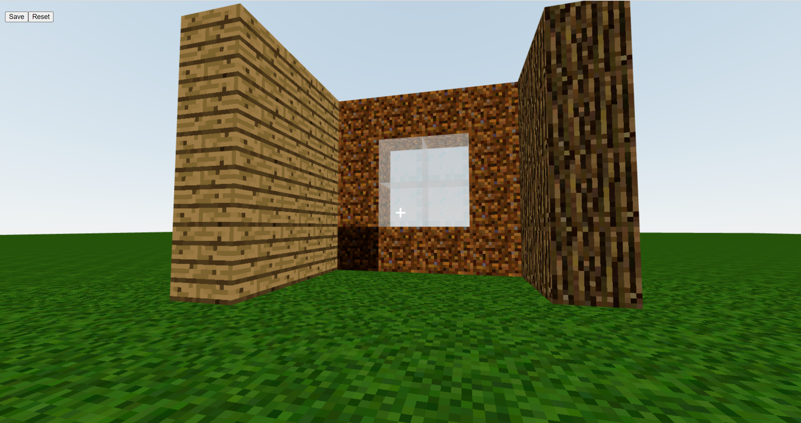
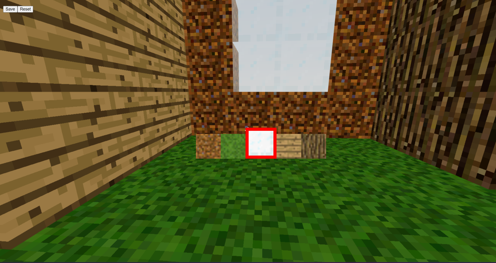
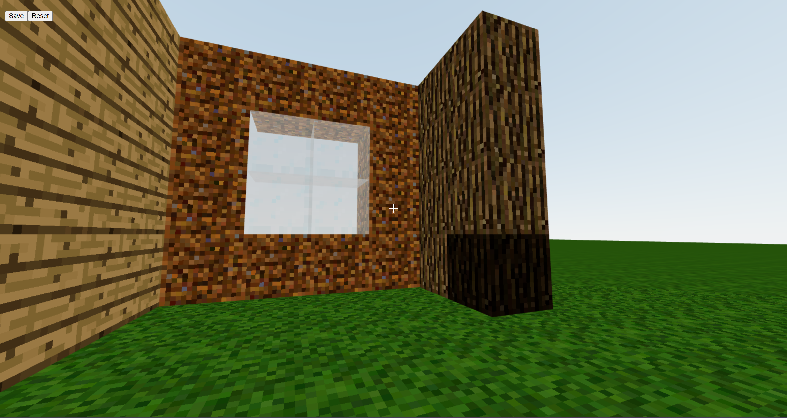

# ReactCraft

Welcome to ReactCraft, a delightful blend of Minecraft's classic gameplay and the immersive capabilities of React and Three.js. Get ready to dive into a world of block-building adventures where you can construct, demolish, and create structures using a selection of five different blocks. Let your imagination soar as you embark on an exciting journey of creativity and exploration!

  

  

  

## Features

- Intuitive controls and a user-friendly interface.
- Choose from a range of five fundamental blocks: wood, wood planks, cobblestone, dirt, and more.
- Each block has unique characteristics and aesthetics, providing a diverse palette to bring your ideas to life.
- Build structures that reflect your imagination, such as castles, cottages, bunkers, or landscapes.
- Combine different block types strategically to add depth and character to your creations.
- Real-time reactions and responsive gameplay powered by React and Three.js.

## How to Play

1. Currently, there are five types of blocks available: Grass, Wood, Log, Glass, and Dirt.
2. Switch between blocks using the numbers 1-5 on your keyboard.
3. Navigate the world using the mouse and WASD keys.
4. Click to add blocks and use Alt+Click to remove blocks.
5. Your world is stored in your browser's local storage.

## Getting Started

To run the game locally, follow these steps:

1. Clone this repository to your local machine.
2. Install the required dependencies by running `npm install`.
3. Start the development server with `npm start`.
4. Open your browser and visit [http://localhost:3000](http://localhost:3000) to play the game.
5. Make edits to the code, and the page will automatically reload with your changes.
6. Check the console for any lint errors during development.

## License

This project is licensed under the [MIT License](https://github.com/Kartik-Katkar/ReactCraft/blob/main/LICENSE).

## Acknowledgements

- This project was bootstrapped with [Create React App](https://github.com/facebook/create-react-app).
- Thanks to Freecodecamp for guding through the peoject
